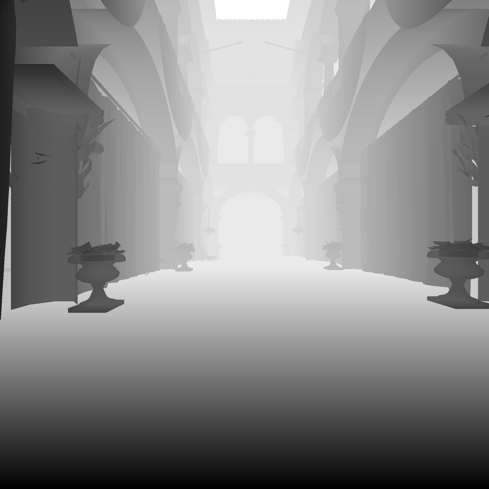

# 🌋 Pompeii

**Pompeii** is a Vulkan-based Graphics Renderer written in C++, by Kobe Dereyne.
It is a learning project to explore the Vulkan API.
 
 
Link to repository: [GitHub Repo](https://github.com/Kobazaaa/Pompeii.git)

## 📸 Screenshots

Sponza Scene with Transparent Objects (no mipmapping):

Sponza Scene Hallway (mipmapping):

GBuffer Albedo Opacity:

One side of a point light's Depth Buffer:

HDR Output:

Final Result:

## 📁 Folder Structure

<pre>
Pompeii/ 
├── cmake/			# CMake Scripts.
├── images/			# images for the README.md, such as screenshots.
├── project/			# project code and assets.
|	├── shaders/
|	├── src/		# source code.
|	|    ├── commands/
|	|    ├── context/
|	|    ├── core/
|	|    ├── graphics/
|	|    |       ├── memory/
|	|    |       ├── passes/
|	|    |       └── pipeline/
|	|    ├── helper/
|	|    ├── presentation/
|	|    └── scene/
|	└── CmakeLists.txt	# Build configuration project.
├── .gitattributes		
├── .gitignore			
├── CMakeLists.txt		# Build configuration global.
├── CMakeSettings.json
├── LICENSE.txt
└── README.md			# ⭕ You are here :)
</pre>

## 🙏 Resources

Graphics Programming Teachers at Howest University - Digital Arts & Entertainment  
The Vulkan Tutorial at [vulkan-tutorial.com](https://vulkan-tutorial.com)  
Morgan McGuire's [Computer Graphics Archive](https://casual-effects.com/data)  
Khronos Groups's [glTF Sample Assets](https://github.com/KhronosGroup/glTF-Sample-Assets/tree/main)  
OpenGL's Tutorials at [LearnOpenGL](https://learnopengl.com)  
Extra repository storing all the models and textures used are at [Pompeii Resources Repository](https://github.com/Kobazaaa/PompeiiResources.git)

## 📚 Third-Party Libraries

This project uses the following third-party libraries:

### Vulkan

| Library                                | Purpose          |
|----------------------------------------|------------------|
| [Vulkan API](https://vulkan.lunarg.com) | Vulkan |
| [Vulkan Memory Allocator (VMA)](https://github.com/GPUOpen-LibrariesAndSDKs/VulkanMemoryAllocator.git) | Vulkan Memory |

### Other

| Library                                | Purpose          |
|----------------------------------------|------------------|
| [GLFW](https://github.com/glfw/glfw.git) | Window & Input |
| [glm](https://github.com/g-truc/glm.git) | Math Library |
| [stb](https://github.com/nothings/stb.git) | Texture Loading |
| [Open Asset Import Library (Assimp)](https://github.com/assimp/assimp.git) | Model Loading |
